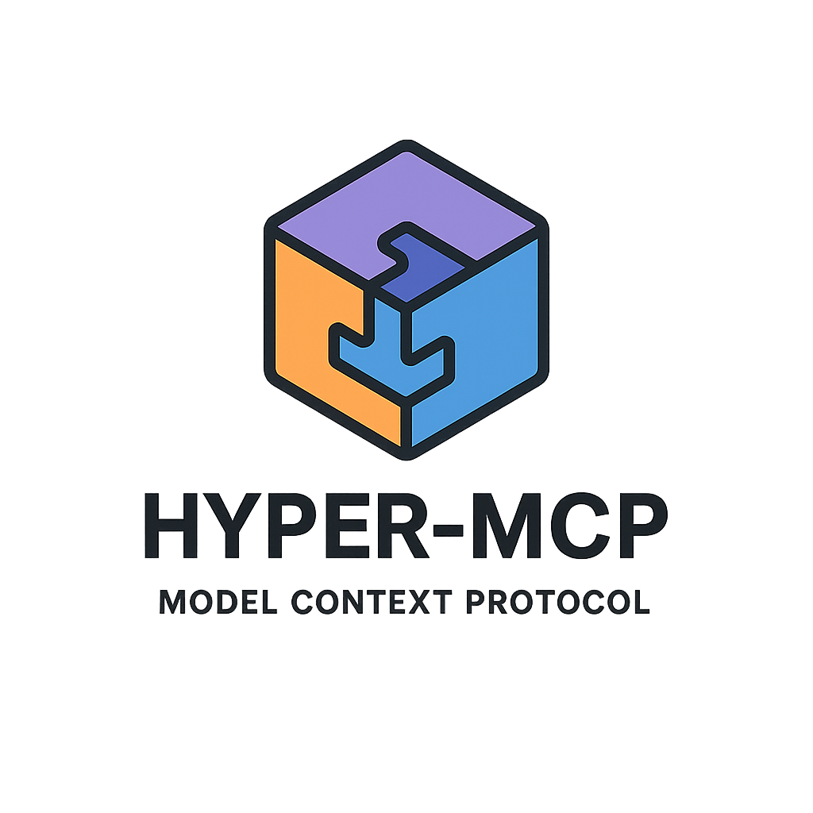
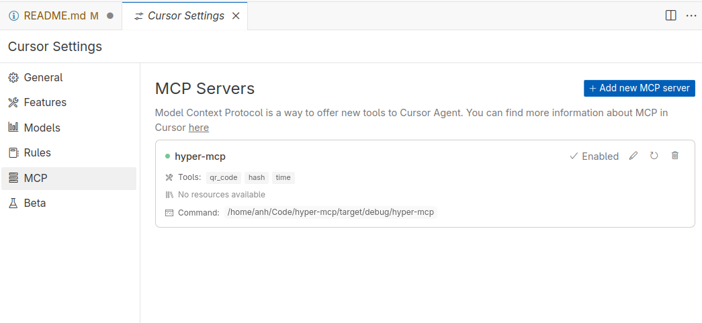
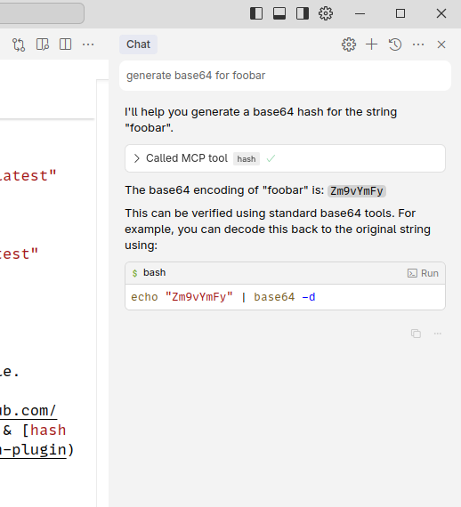

<div align="center">
  <picture>
    
  </picture>
</div>

<div align="center">

[](https://crates.io/crates/hyper-mcp)
[](#license)
[](https://github.com/tuananh/hyper-mcp/issues)


<a href="https://trendshift.io/repositories/13451" target="_blank"></a>

</div>

# hyper-mcp

A fast, secure MCP server that extends its capabilities through WebAssembly plugins.

## What is it?

hyper-mcp makes it easy to add AI capabilities to your applications. It works with Claude Desktop, Cursor IDE, and other MCP-compatible apps. Write plugins in your favorite language, distribute them through container registries, and run them anywhere - from cloud to edge.

## Features

- Write plugins in any language that compiles to WebAssembly
- Distribute plugins via standard OCI registries (like Docker Hub)
- Built on [Extism](https://github.com/extism/extism) for rock-solid plugin support
- Sanboxing with WASM: ability to limit network, filesystem, memory access
- Lightweight enough for resource-constrained environments
- Support all 3 protocols in the spec: `stdio`, `sse` and `streamble-http`.
- Deploy anywhere: serverless, edge, mobile, IoT devices
- Cross-platform compatibility out of the box
- Support tool name prefix to prevent tool names collision

## Security

Built with security-first mindset:

- Sandboxed plugins that can't access your system without permission
- Memory-safe execution with resource limits
- Secure plugin distribution through container registries
- Fine-grained access control for host functions
- OCI plugin images are signed at publish time and verified at load time with [sigstore](https://www.sigstore.dev/).

## Getting Started

1. Create your config file:
   - Linux: `$HOME/.config/hyper-mcp/config.json`
   - Windows: `{FOLDERID_RoamingAppData}`. Eg: `C:\Users\Alice\AppData\Roaming`
   - macOS: `$HOME/Library/Application Support/hyper-mcp/config.json`

```json
{
  "plugins": {
    "time": {
      "url": "oci://ghcr.io/tuananh/time-plugin:latest"
    },
    "qr_code": {
      "url": "oci://ghcr.io/tuananh/qrcode-plugin:latest"
    },
    "hash": {
      "url": "oci://ghcr.io/tuananh/hash-plugin:latest"
    },
    "myip": {
      "url": "oci://ghcr.io/tuananh/myip-plugin:latest",
      "runtime_config": {
        "allowed_hosts": ["1.1.1.1"]
      }
    },
    "fetch": {
      "url": "oci://ghcr.io/tuananh/fetch-plugin:latest",
      "runtime_config": {
        "allowed_hosts": ["*"],
        "memory_limit": "100 MB",
      }
    }
  }
}
```

> 📖 **For detailed configuration options including authentication setup, runtime configuration, and advanced features, see [RUNTIME_CONFIG.md](./RUNTIME_CONFIG.md)**

Supported URL schemes:
- `oci://` - for OCI-compliant registries (like Docker Hub, GitHub Container Registry, etc.)
- `file://` - for local files
- `http://` or `https://` - for remote files
- `s3://` - for Amazon S3 objects (requires that you have your AWS credentials set up in the environment)

2. Start the server:

```sh
$ hyper-mcp
```

- By default, it will use `stdio` transport. If you want to use SSE, use flag `--transport sse` or streamable HTTP with `--transport streamable-http`.
- If you want to debug, use `RUST_LOG=info`.
- If you're loading unsigned OCI plugin, you need to set `insecure_skip_signature` flag or env var `HYPER_MCP_INSECURE_SKIP_SIGNATURE` to `true`

## Using with Cursor IDE

You can configure hyper-mcp either globally for all projects or specifically for individual projects.

1. For project-scope configuration, create `.cursor/mcp.json` in your project root:
```json
{
  "mcpServers": {
    "hyper-mcp": {
      "command": "/path/to/hyper-mcp"
    }
  }
}
```

2. Set up hyper-mcp in Cursor's settings:
   

3. Start using tools through chat:
   

## Available Plugins

We maintain several example plugins to get you started:

### V1 Plugins

These plugins use the v1 plugin interface. While still supported, new plugins should use the v2 interface.

- [time](https://github.com/tuananh/hyper-mcp/tree/main/examples/plugins/v1/time): Get current time and do time calculations (Rust)
- [qr_code](https://github.com/tuananh/hyper-mcp/tree/main/examples/plugins/v1/qr-code): Generate QR codes (Rust)
- [hash](https://github.com/tuananh/hyper-mcp/tree/main/examples/plugins/v1/hash): Generate various types of hashes (Rust)
- [myip](https://github.com/tuananh/hyper-mcp/tree/main/examples/plugins/v1/myip): Get your current IP (Rust)
- [fetch](https://github.com/tuananh/hyper-mcp/tree/main/examples/plugins/v1/fetch): Basic webpage fetching (Rust)
- [crypto_price](https://github.com/tuananh/hyper-mcp/tree/main/examples/plugins/v1/crypto-price): Get cryptocurrency prices (Go)
- [fs](https://github.com/tuananh/hyper-mcp/tree/main/examples/plugins/v1/fs): File system operations (Rust)
- [github](https://github.com/tuananh/hyper-mcp/tree/main/examples/plugins/v1/github): GitHub plugin (Go)
- [eval_py](https://github.com/tuananh/hyper-mcp/tree/main/examples/plugins/v1/eval-py): Evaluate Python code with RustPython (Rust)
- [arxiv](https://github.com/tuananh/hyper-mcp/tree/main/examples/plugins/v1/arxiv): Search & download arXiv papers (Rust)
- [memory](https://github.com/tuananh/hyper-mcp/tree/main/examples/plugins/v1/memory): Let you store & retrieve memory, powered by SQLite (Rust)
- [sqlite](https://github.com/tuananh/hyper-mcp/tree/main/examples/plugins/v1/sqlite): Interact with SQLite (Rust)
- [crates-io](https://github.com/tuananh/hyper-mcp/tree/main/examples/plugins/v1/crates-io): Get crate general information, check crate latest version (Rust)
- [gomodule](https://github.com/tuananh/hyper-mcp/tree/main/examples/plugins/v1/gomodule): Get Go modules info, version (Rust)
- [qdrant](https://github.com/tuananh/hyper-mcp/tree/main/examples/plugins/v1/qdrant): keeping & retrieving memories to Qdrant vector search engine (Rust)
- [gitlab](https://github.com/tuananh/hyper-mcp/tree/main/examples/plugins/v1/gitlab): GitLab plugin (Rust)
- [meme_generator](https://github.com/tuananh/hyper-mcp/tree/main/examples/plugins/v1/meme-generator): Meme generator (Rust)
- [context7](https://github.com/tuananh/hyper-mcp/tree/main/examples/plugins/v1/context7): Lookup library documentation (Rust)
- [think](https://github.com/tuananh/hyper-mcp/tree/main/examples/plugins/v1/think): Think tool(Rust)
- [maven](https://github.com/tuananh/hyper-mcp/tree/main/examples/plugins/v1/maven): Maven plugin (Rust)
- [serper](https://github.com/tuananh/hyper-mcp/tree/main/examples/plugins/v1/serper): Serper web search plugin (Rust)

### V2 Plugins
These plugins use the v2 plugin interface. New plugins should use this interface.

- [rstime](https://github.com/tuananh/hyper-mcp/tree/main/examples/plugins/v2/rstime): Get current time and do time calculations (Rust)


### Community-built plugins

- [hackernews](https://github.com/hungran/hyper-mcp-hackernews-tool): This plugin connects to the Hacker News API to fetch the current top stories and display them with their titles, scores, authors, and URLs.
- [release-monitor-id](https://github.com/ntheanh201/hyper-mcp-release-monitor-id-tool): This plugin retrieves project ID from release-monitoring.org, which helps track versions of released software.
- [yahoo-finance](https://github.com/phamngocquy/hyper-mcp-yfinance): This plugin connects to the Yahoo Finance API to provide stock prices (OHLCV) based on a company name or ticker symbol.
- [rand16](https://github.com/dabevlohn/rand16): This plugen generates random 16 bytes buffer and provides it in base64uri format - very usable for symmetric cryptography online.

## Documentation

- **[Runtime Configuration Guide](./RUNTIME_CONFIG.md)** - Comprehensive guide to configuration options including:
  - Authentication setup (Basic, Token, and Keyring)
  - Plugin runtime configuration
  - Security considerations and best practices
  - Platform-specific keyring setup for macOS, Linux, and Windows
  - Troubleshooting authentication issues
- **[Skip Tools Pattern Guide](./SKIP_TOOLS_GUIDE.md)** - Comprehensive guide to filtering tools using regex patterns:
  - Pattern syntax and examples
  - Common use cases and best practices
  - Environment-specific filtering strategies
  - Advanced regex techniques
  - Migration and troubleshooting

## Creating Plugins

For comprehensive instructions on creating plugins, see [CREATING_PLUGINS.md](./CREATING_PLUGINS.md).

## License

[Apache 2.0](./LICENSE)

## Star History

[](https://www.star-history.com/#tuananh/hyper-mcp&Date)
